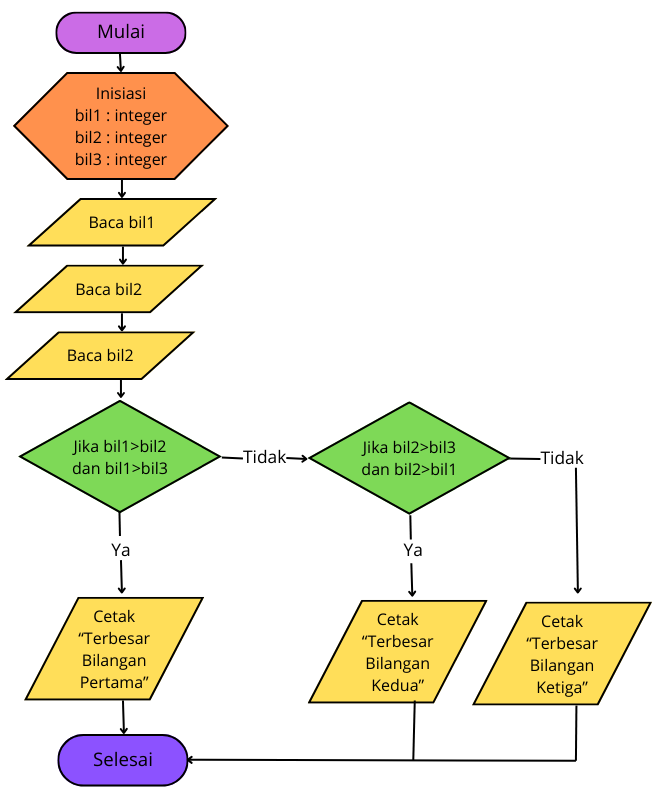
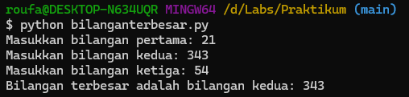
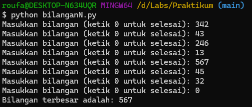

# Praktikum

Nama : Roufan Awaluna Romadhon
NIM : 31210423
Kelas : TI.24.A.3

Repository ini berisi dua tugas yang dikerjakan dalam Tugas pertemuan 5. Berikut tugasnya:
1. Tiga bilangan yang diinputkan pengguna.
2. Beberapa bilangan yang diinputkan pengguna sampai pengguna memasukkan angka `0`.

---

## Menentukan bilangan terbesar dari 3 buah bilangan yang diinputkan

### Deskripsi
Pada tugas ini, pengguna akan memasukkan tiga buah bilangan, dan program akan menentukan bilangan terbesar dari ketiga bilangan tersebut.

### Flowchart
Flowchartnya adalah sebagai berikut:

### Kode Program
Kode program dapat dilihat di file [`Kode 1`](bilanganterbesar.py).

### Penjelasan Program
- Program meminta pengguna untuk memasukkan tiga bilangan.
- Program kemudian membandingkan ketiga bilangan tersebut dan mencetak bilangan terbesar.

### Screenshot Hasil Eksekusi
Berikut adalah hasil eksekusi programnya:

---

## Menentukan bilangan terbesar dari N bilangan yang diinputkan, untuk menentukan jumlah N, berikan masukan angka 0.

### Deskripsi
Pada tugas ini, pengguna akan memasukkan beberapa bilangan sampai pengguna memasukkan angka `0`. Program kemudian akan menentukan bilangan terbesar dari semua bilangan yang diinputkan sebelum angka `0`.

### Flowchart
Flowchartnya adalah sebagai berikut:

### Kode Program
Kode program dapat dilihat di file [`Kode 2`](bilanganN.py).

### Penjelasan Program
- Program diinisialisasi dengan nilai `max_value` yang diset ke `-∞` (negatif tak hingga).
- Program akan terus meminta input dari pengguna hingga angka `0` dimasukkan.
- Setiap input dibandingkan dengan nilai `max_value`, dan jika lebih besar, nilai `max_value` diperbarui.
- Setelah angka `0` dimasukkan, program akan keluar dari loop dan mencetak bilangan terbesar yang telah ditemukan.

### Screenshot Hasil Eksekusi
Berikut adalah hasil eksekusi programnya:

---
