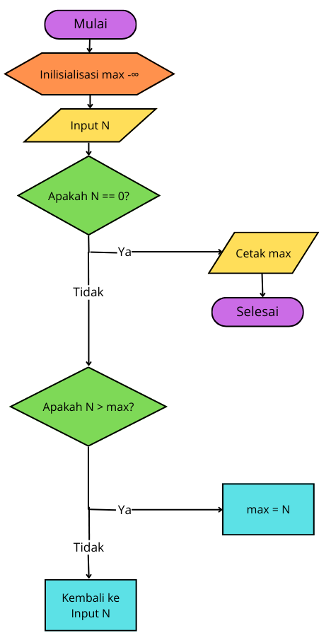

# Praktikum

Nama : Roufan Awaluna Romadhon
NIM : 31210423
Kelas : TI.24.A.3

Repository ini berisi dua tugas yang dikerjakan dalam Tugas pertemuan 5. Berikut tugasnya:
1. Tiga bilangan yang diinputkan pengguna.
2. Beberapa bilangan yang diinputkan pengguna sampai pengguna memasukkan angka `0`.

---

## Menentukan bilangan terbesar dari 3 buah bilangan yang diinputkan

### Deskripsi
Pada tugas ini, pengguna akan memasukkan tiga buah bilangan, dan program akan menentukan bilangan terbesar dari ketiga bilangan tersebut.

### Flowchart
Flowchartnya adalah sebagai berikut:


### Kode Program
Kode program dapat dilihat dibawah ini atau buka file ini [`bilanganterbesar.py`](bilanganterbesar.py).
```python
# Inisialisasi dan membaca input dari pengguna
bil1 = int(input("Masukkan bilangan pertama: "))
bil2 = int(input("Masukkan bilangan kedua: "))
bil3 = int(input("Masukkan bilangan ketiga: "))

# Perbandingan untuk menentukan bilangan terbesar
if bil1 > bil2 and bil1 > bil3:
    print("Bilangan terbesar adalah bilangan pertama:", bil1)
elif bil2 > bil3 and bil2 > bil1:
    print("Bilangan terbesar adalah bilangan kedua:", bil2)
else:
    print("Bilangan terbesar adalah bilangan ketiga:", bil3)
```

### Penjelasan Program
- Program akan meminta input tiga bilangan dari pengguna.
- Setelah ketiga bilangan dimasukkan, program membandingkan bilangan-bilangan tersebut.
- Jika bilangan pertama lebih besar dari bilangan kedua dan ketiga, maka bilangan pertama adalah yang terbesar.
- Jika bilangan kedua lebih besar dari yang lainnya, maka bilangan kedua adalah yang terbesar.
- Jika tidak, bilangan ketiga adalah yang terbesar.
- Hasil bilangan terbesar akan dicetak.

### Screenshot Hasil Eksekusi
Berikut adalah hasil eksekusi programnya:


---

## Menentukan bilangan terbesar dari N bilangan yang diinputkan, untuk menentukan jumlah N, berikan masukan angka 0.

### Deskripsi
Pada tugas ini, pengguna akan memasukkan beberapa bilangan sampai pengguna memasukkan angka `0`. Program kemudian akan menentukan bilangan terbesar dari semua bilangan yang diinputkan sebelum angka `0`.

### Flowchart
Flowchartnya adalah sebagai berikut:



### Kode Program
Kode program dapat dilihat dibawah ini atau buka file ini [`bilanganN.py`](bilanganN.py).
```python
# Inisialisasi max dengan nilai sangat kecil
max_value = float('-inf')

while True:
    # Input bilangan dari pengguna
    N = int(input("Masukkan bilangan (ketik 0 untuk selesai): "))
    
    # Jika bilangan adalah 0, keluar dari loop
    if N == 0:
        break
    
    # Jika bilangan lebih besar dari max_value, perbarui max_value
    if N > max_value:
        max_value = N

# Cetak bilangan terbesar yang ditemukan
print("Bilangan terbesar adalah:", max_value)
```

### Penjelasan Program
- Program diinisialisasi dengan nilai `max_value` yang diset ke `-∞` (negatif tak hingga).
- Program akan terus meminta input dari pengguna hingga angka `0` dimasukkan.
- Setiap input dibandingkan dengan nilai `max_value`, dan jika lebih besar, nilai `max_value` diperbarui.
- Setelah angka `0` dimasukkan, program akan keluar dari loop dan mencetak bilangan terbesar yang telah ditemukan.

### Screenshot Hasil Eksekusi
Berikut adalah hasil eksekusi programnya:


---
